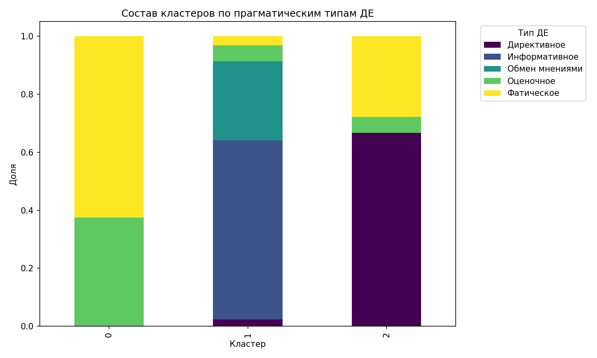
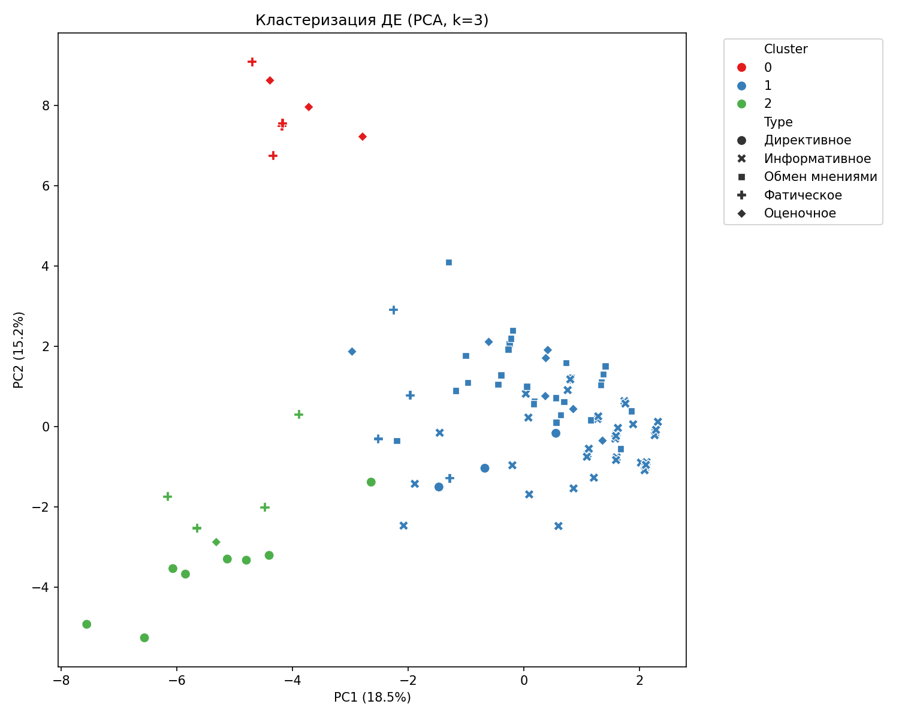

# Результаты анализа диалогических единиц и семинаров

## 1. Анализ XML (корпус семинаров)

- **Семинаров:** 10  
- **Диалогических единиц (ДЕ):** 153  
- **Реплик (turn):** 485  
- **Всего слов:** 48 541  
- **Всего предложений:** 3 586  

**Длины:**  
- Средняя длина реплики: 100 слов  
- Медианная длина реплики: 44 слова  
- Средняя длина предложения: 13,5 слов  
- Медианная длина предложения: 9 слов  

**Характеристики ДЕ:**  
- Среднее количество слов в ДЕ: 317  
- Медианное количество слов в ДЕ: 230  
- Среднее количество реплик в ДЕ: 3,2  
- Медианное количество реплик в ДЕ: 2  

---

## 2. Анализ CSV (размеченные диалогические единицы)

**Общее количество ДЕ в CSV:** 154

### Распределение по столбцам

| Поле | Значение |
|------|----------|
| **Позиция ДЕ** | начало – 98 (63,6%) середина – 53 (34,4%) конец – 3 (1,9%) |
| **Тип ДЕ** | Информативное – 79 (51,3%) Обмен мнениями – 35 (22,7%) Директивное – 15 (9,7%) Фатическое – 14 (9,1%) Оценочное – 11 (7,1%) |
| **Стимул** | вопросная – 72 (46,8%) повествовательная – 69 (44,8%) побудительная – 12 (7,8%) |
| **Реакция (топ-5)** | ответ – 64 ответ, пояснение – 10 согласие – 9 согласие, пояснение – 7 ответ, согласие – 6 |
| **Эллипсис** | да – 54 (35,1%) нет – 99 (64,3%) |
| **Синтаксический параллелизм** | да – 0 (0%) нет – 153 (99,4%) |
| **Маркеры хезитации** | да – 137 (89,0%) нет – 17 (11,0%) |
| **Вербальная компенсация** | да – 7 (4,5%) нет – 147 (95,5%) |
| **Наложения/разрывы** | да – 3 (1,9%) нет – 151 (98,1%) |
| **Функция ДЕ** | объяснительная – 88 (57,1%) организационная – 26 (16,9%) контролирующая – 13 (8,4%) обмен мнениями – 13 (8,4%) фатическая – 10 (6,5%) оценочная – 4 (2,6%) |
| **Связь с макротемой** | развитие темы – 128 (83,1%) открытие темы – 17 (11,0%) закрытие темы – 9 (5,8%) |
| **Связь с предыдущим ДЕ** | да – 145 (94,2%) нет – 9 (5,8%) |
| **Связь с последующим ДЕ** | да – 146 (94,8%) нет – 8 (5,2%) |

### Объединённые типы реплик-реакций

- ответ – 94  
- согласие – 44  
- пояснение – 38  
- развитие – 10  
- благодарность – 10  
- оценка – 8  
- уточнение – 7  
- вопрос – 5  
- фатическая – 3  

### Конструктивные средства связи (топ-5)

1. лексический повтор – 116  
2. вопрос-ответ – 50  
3. частицы – 28  
4. нет – 8  
5. местоименная замена – 7  

### Количество реплик в ДЕ

- среднее – 3,16  
- медиана – 2  
- минимум – 1, максимум – 16  

### Базовые распределения (визуализация)

---

## 3. Корреляционный анализ (Cramér's V)

- Размерность one‑hot матрицы: **154 × 37**  
- **Тепловая карта корреляций**

### Сильные корреляции (Cramér's V > 0,5)

| Связь | Cramér's V |
|-------|------------|
| Связь с макротемой семинара ↔ Наличие связи с последующим ДЕ | 0,936 |
| Функция в структуре семинара ↔ Наличие связи с последующим ДЕ | 0,873 |
| Функция в структуре семинара ↔ Связь с макротемой семинара | 0,772 |
| Характеристика реплики-стимула ↔ Наличие маркеров хезитации | 0,659 |
| Наличие маркеров хезитации ↔ Функция в структуре семинара | 0,617 |

---

## 4. Кластеризация диалогических единиц

**Выбор числа кластеров по силуэту:**  

- k=2: 0,3620  
- **k=3: 0,4048** ← выбрано  
- k=4: 0,2693  
- k=5: 0,2836  
- k=6: 0,2989  
- k=7: 0,3079  
- k=8: 0,3164  
- k=9: 0,3153  

### График силуэта

### Результат кластеризации

Файл: `dialogic_units_clustered.csv`

### Распределение типов ДЕ по кластерам (в % по строкам)

| Кластер | Директивное | Информативное | Обмен мнениями | Оценочное | Фатическое |
|---------|-------------|---------------|----------------|-----------|-------------|
| **0**   | 0%          | 0%            | 0%             | 37,5%     | 62,5%       |
| **1**   | 2,3%        | 61,7%         | 27,3%          | 5,5%      | 3,1%        |
| **2**   | 66,7%       | 0%            | 0%             | 5,6%      | 27,8%       |

**Интерпретация:**  
- **Кластер 0** – почти полностью фатические и оценочные ДЕ.  
- **Кластер 1** – доминируют информативные, значительная доля обмена мнениями.  
- **Кластер 2** – преимущественно директивные, с заметной примесью фатических.  

### Диаграмма состава кластеров

---

## 5. PCA-визуализация

- Доля объяснённой дисперсии первыми двумя компонентами: **18,5% + 15,2% = 33,7%**  

---
