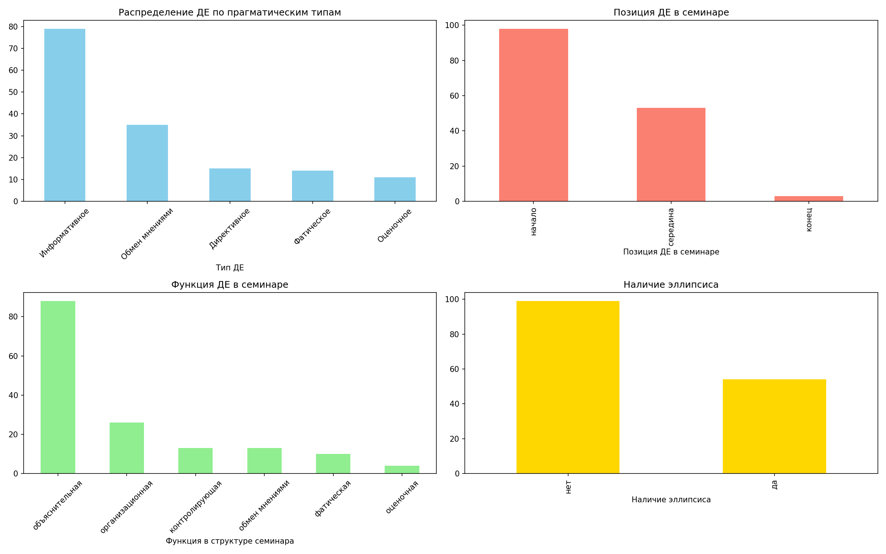
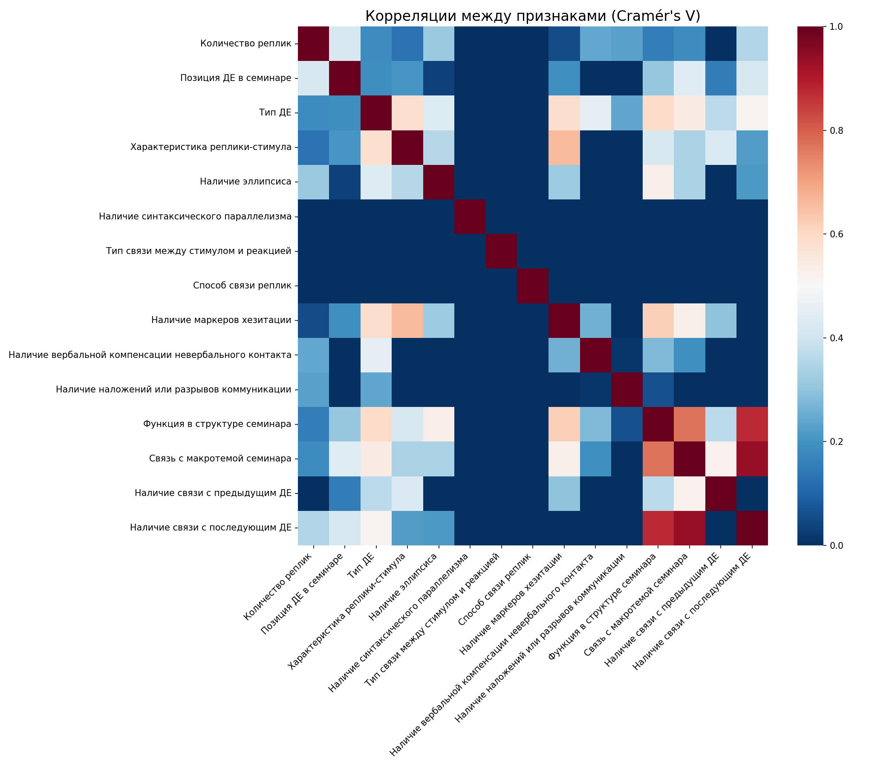

# Результаты анализа диалогических единиц и семинаров

## 1. Анализ XML (корпус семинаров)

- **Семинаров:** 10  
- **Диалогических единиц (ДЕ):** 154  
- **Реплик (turn):** 485  
- **Всего слов:** 48 541  
- **Всего предложений:** 3 586  

**Длины:**  
- Средняя длина реплики: 100 слов  
- Медианная длина реплики: 44 слова  
- Средняя длина предложения: 13,5 слов  
- Медианная длина предложения: 9 слов  

**Характеристики ДЕ:**  
- Среднее количество слов в ДЕ: 317  
- Медианное количество слов в ДЕ: 230  
- Среднее количество реплик в ДЕ: 3,2  
- Медианное количество реплик в ДЕ: 2  

---

## 2. Анализ CSV (размеченные диалогические единицы)

**Общее количество ДЕ в CSV:** 154

### Распределение по столбцам

| Поле | Значение                                                                                                                                          |
|------|---------------------------------------------------------------------------------------------------------------------------------------------------|
| **Позиция ДЕ** | начало – 54<br>середина – 52<br>конец – 48                                                                                                        |
| **Тип ДЕ** | Информативное – 79 (51,3%)<br>Обмен мнениями – 35 (22,7%)<br>Директивное – 15 (9,7%)<br>Фатическое – 14 (9,1%)<br>Оценочное – 11 (7,1%)           |
| **Стимул** | вопросная – 72 (46,8%)<br>повествовательная – 69 (44,8%)<br>побудительная – 12 (7,8%)                                                             |
| **Реакция (топ-5)** | ответ – 64<br>ответ, пояснение – 10<br>согласие – 9<br>согласие, пояснение – 7<br>ответ, согласие – 6                                             |
| **Эллипсис** | да – 54 (35,1%)<br>нет – 99 (64,3%)                                                                                                               |
| **Синтаксический параллелизм** | да – 0 (0%)<br>нет – 154 (100%)                                                                                                                   |
| **Маркеры хезитации** | да – 137 (89,0%)<br>нет – 17 (11,0%)                                                                                                              |
| **Вербальная компенсация** | да – 7 (4,5%)<br>нет – 147 (95,5%)                                                                                                                |
| **Наложения/разрывы** | да – 3 (1,9%)<br>нет – 151 (98,1%)                                                                                                                |
| **Функция ДЕ** | объяснительная – 88 (57,1%)<br>организационная – 26 (16,9%)<br>контролирующая – 13 (8,4%)<br>обмен мнениями – 13 (8,4%)<br>фатическая – 10 (6,5%)<br>оценочная – 4 (2,6%) |
| **Связь с макротемой** | развитие темы – 128 (83,1%)<br>открытие темы – 17 (11,0%)<br>закрытие темы – 9 (5,8%)                                                             |
| **Связь с предыдущим ДЕ** | да – 145 (94,2%)<br>нет – 9 (5,8%)                                                                                                                |
| **Связь с последующим ДЕ** | да – 146 (94,8%)<br>нет – 8 (5,2%)                                                                                                                |

### Типы реплик-реакций

- ответ – 94  
- согласие – 44  
- пояснение – 38  
- развитие – 10  
- благодарность – 10  
- оценка – 8  
- уточнение – 7  
- вопрос – 5  
- фатическая – 3  

### Конструктивные средства связи (топ-5)

1. лексический повтор – 116  
2. вопрос-ответ – 50  
3. частицы – 28  
4. нет – 8  
5. местоименная замена – 7  

### Количество реплик в ДЕ

- среднее – 3,16  
- медиана – 2  
- минимум – 2, максимум – 16  

### Базовые распределения (визуализация)



---

## 3. Корреляционный анализ (Cramér's V)

- Размерность one‑hot матрицы: **154 × 37**  
- **Тепловая карта корреляций**



### Сильные корреляции (Cramér's V > 0,5)

| Связь | Cramér's V |
|-------|------------|
| Связь с макротемой семинара ↔ Наличие связи с последующим ДЕ | 0,936 |
| Функция в структуре семинара ↔ Наличие связи с последующим ДЕ | 0,873 |
| Функция в структуре семинара ↔ Связь с макротемой семинара | 0,772 |
| Характеристика реплики-стимула ↔ Наличие маркеров хезитации | 0,659 |
| Наличие маркеров хезитации ↔ Функция в структуре семинара | 0,617 |

---

## 4. Кластеризация диалогических единиц

**Выбор числа кластеров по силуэту:**  

- k=2: 0,3620  
- **k=3: 0,4048** ← выбрано  
- k=4: 0,2693  
- k=5: 0,2836  
- k=6: 0,2989  
- k=7: 0,3079  
- k=8: 0,3164  
- k=9: 0,3153  

### График силуэта


### Результат кластеризации

Файл: `dialogic_units_clustered.csv`

### Распределение типов ДЕ по кластерам (в % по строкам)

| Кластер | Директивное | Информативное | Обмен мнениями | Оценочное | Фатическое |
|---------|-------------|---------------|----------------|-----------|-------------|
| **0**   | 0%          | 0%            | 0%             | 37,5%     | 62,5%       |
| **1**   | 2,3%        | 61,7%         | 27,3%          | 5,5%      | 3,1%        |
| **2**   | 66,7%       | 0%            | 0%             | 5,6%      | 27,8%       |

**Интерпретация:**  
- **Кластер 0** – почти полностью фатические и оценочные ДЕ.  
- **Кластер 1** – доминируют информативные, значительная доля обмена мнениями.  
- **Кластер 2** – преимущественно директивные, с заметной примесью фатических.  

### Диаграмма состава кластеров


---

## 5. PCA-визуализация

- Доля объяснённой дисперсии первыми двумя компонентами: **18,5% + 15,2% = 33,7%**  


---
## Результаты анализа диалогических единиц

```plaintext
=== Тип ДЕ: Директивное (всего строк: 15) ===

Столбец: Количество реплик
  2: 14 (93.3%)
  7: 1 (6.7%)

Столбец: Позиция ДЕ в семинаре
  начало: 14 (93.3%)
  середина: 1 (6.7%)

Столбец: Характеристика реплики-стимула
  побудительная: 11 (73.3%)
  вопросная: 3 (20.0%)
  повествовательная: 1 (6.7%)

Столбец: Наличие эллипсиса
  да: 11 (73.3%)
  нет: 4 (26.7%)

Столбец: Наличие маркеров хезитации
  нет: 10 (66.7%)
  да: 5 (33.3%)

Столбец: Функция в структуре семинара
  организационная: 13 (86.7%)
  контролирующая: 2 (13.3%)

Столбец: Связь с макротемой семинара
  открытие темы: 8 (53.3%)
  развитие темы: 7 (46.7%)

Столбец: Наличие связи с предыдущим ДЕ
  да: 10 (66.7%)
  нет: 5 (33.3%)

Столбец: Наличие связи с последующим ДЕ
  да: 15 (100.0%)

Ключевые слова-маркеры — топ-5 слов:
  вопросы: 6
  давайте: 4
  спасибо: 4
  пожалуйста: 3
  да: 3

Микротема — топ-5 слов:
  вопросы: 4
  передача: 4
  семинара: 3
  слова: 3
  приглашение: 3

Конструктивные средства связи — топ-5 слов:
  лексический: 10
  повтор: 10
  нет: 3
  частица: 1
  ну: 1

Характеристика реплики-реакции — топ-5 слов:
  согласие: 8
  ответ: 3
  пояснение: 1
  развитие: 1
  уточнение: 1

=== Тип ДЕ: Информативное (всего строк: 79) ===

Столбец: Количество реплик
  2: 43 (54.4%)
  3: 16 (20.3%)
  4: 11 (13.9%)
  5: 3 (3.8%)
  6: 3 (3.8%)
  8: 1 (1.3%)
  16: 1 (1.3%)
  7: 1 (1.3%)

Столбец: Позиция ДЕ в семинаре
  начало: 55 (69.6%)
  середина: 24 (30.4%)

Столбец: Характеристика реплики-стимула
  вопросная: 61 (77.2%)
  повествовательная: 16 (20.3%)
  повествовательная с вопросами: 1 (1.3%)
  побудительная: 1 (1.3%)

Столбец: Наличие эллипсиса
  нет: 65 (82.3%)
  да: 14 (17.7%)

Столбец: Наличие маркеров хезитации
  да: 77 (97.5%)
  нет: 2 (2.5%)

Столбец: Функция в структуре семинара
  объяснительная: 71 (89.9%)
  контролирующая: 6 (7.6%)
  организационная: 2 (2.5%)

Столбец: Связь с макротемой семинара
  развитие темы: 78 (98.7%)
  открытие темы: 1 (1.3%)

Столбец: Наличие связи с предыдущим ДЕ
  да: 77 (97.5%)
  нет: 2 (2.5%)

Столбец: Наличие связи с последующим ДЕ
  да: 79 (100.0%)

Ключевые слова-маркеры — топ-5 слов:
  ли: 15
  да: 12
  не: 9
  как: 8
  что: 7

Микротема — топ-5 слов:
  вопрос: 15
  на: 11
  уточнение: 10
  ответ: 10
  для: 8

Конструктивные средства связи — топ-5 слов:
  повтор: 54
  лексический: 53
  вопрос: 46
  ответ: 46
  частицы: 7

Характеристика реплики-реакции — топ-5 слов:
  ответ: 70
  пояснение: 16
  вопрос: 3
  уточнение: 3
  согласие: 2

=== Тип ДЕ: Обмен мнениями (всего строк: 35) ===

Столбец: Количество реплик
  2: 12 (34.3%)
  3: 12 (34.3%)
  4: 3 (8.6%)
  7: 2 (5.7%)
  5: 2 (5.7%)
  6: 2 (5.7%)
  9: 1 (2.9%)
  10: 1 (2.9%)

Столбец: Позиция ДЕ в семинаре
  середина: 18 (51.4%)
  начало: 16 (45.7%)
  конец: 1 (2.9%)

Столбец: Характеристика реплики-стимула
  повествовательная: 32 (91.4%)
  вопросная: 3 (8.6%)

Столбец: Наличие эллипсиса
  нет: 21 (60.0%)
  да: 14 (40.0%)

Столбец: Наличие маркеров хезитации
  да: 34 (97.1%)
  нет: 1 (2.9%)

Столбец: Функция в структуре семинара
  объяснительная: 15 (42.9%)
  обмен мнениями: 13 (37.1%)
  контролирующая: 4 (11.4%)
  организационная: 2 (5.7%)
  оценочная: 1 (2.9%)

Столбец: Связь с макротемой семинара
  развитие темы: 34 (97.1%)
  закрытие темы: 1 (2.9%)

Столбец: Наличие связи с предыдущим ДЕ
  да: 35 (100.0%)

Столбец: Наличие связи с последующим ДЕ
  да: 35 (100.0%)

Ключевые слова-маркеры — топ-5 слов:
  спасибо: 8
  на: 6
  не: 4
  мне: 4
  можно: 3

Микротема — топ-5 слов:
  обсуждение: 8
  данных: 4
  необходимость: 3
  по: 3
  для: 3

Конструктивные средства связи — топ-5 слов:
  лексический: 32
  повтор: 32
  частицы: 12
  нет: 3
  частица: 1

Характеристика реплики-реакции — топ-5 слов:
  согласие: 20
  пояснение: 16
  ответ: 14
  развитие: 13
  уточнение: 3

=== Тип ДЕ: Оценочное (всего строк: 11) ===

Столбец: Количество реплик
  2: 6 (54.5%)
  5: 2 (18.2%)
  8: 1 (9.1%)
  3: 1 (9.1%)
  4: 1 (9.1%)

Столбец: Позиция ДЕ в семинаре
  середина: 5 (45.5%)
  начало: 5 (45.5%)
  конец: 1 (9.1%)

Столбец: Характеристика реплики-стимула
  повествовательная: 10 (90.9%)
  вопросная: 1 (9.1%)

Столбец: Наличие эллипсиса
  нет: 7 (63.6%)
  да: 4 (36.4%)

Столбец: Наличие маркеров хезитации
  да: 10 (90.9%)
  нет: 1 (9.1%)

Столбец: Функция в структуре семинара
  фатическая: 4 (36.4%)
  оценочная: 3 (27.3%)
  объяснительная: 2 (18.2%)
  контролирующая: 1 (9.1%)
  организационная: 1 (9.1%)

Столбец: Связь с макротемой семинара
  развитие темы: 6 (54.5%)
  закрытие темы: 3 (27.3%)
  открытие темы: 2 (18.2%)

Столбец: Наличие связи с предыдущим ДЕ
  да: 10 (90.9%)
  нет: 1 (9.1%)

Столбец: Наличие связи с последующим ДЕ
  да: 8 (72.7%)
  нет: 3 (27.3%)

Ключевые слова-маркеры — топ-5 слов:
  спасибо: 7
  большое: 3
  да: 3
  ситуации: 2
  очень: 2

Микротема — топ-5 слов:
  завершение: 3
  семинара: 3
  благодарность: 2
  обсуждение: 2
  вопрос: 2

Конструктивные средства связи — топ-5 слов:
  лексический: 10
  повтор: 10
  частицы: 2
  местоименная: 1
  замена: 1

Характеристика реплики-реакции — топ-5 слов:
  согласие: 8
  благодарность: 6
  оценка: 6
  пояснение: 2
  ответ: 2

=== Тип ДЕ: Фатическое (всего строк: 14) ===

Столбец: Количество реплик
  3: 5 (35.7%)
  2: 4 (28.6%)
  4: 3 (21.4%)
  7: 1 (7.1%)
  12: 1 (7.1%)

Столбец: Позиция ДЕ в семинаре
  начало: 8 (57.1%)
  середина: 5 (35.7%)
  конец: 1 (7.1%)

Столбец: Характеристика реплики-стимула
  повествовательная: 10 (71.4%)
  вопросная: 4 (28.6%)

Столбец: Наличие эллипсиса
  да: 11 (78.6%)
  нет: 3 (21.4%)

Столбец: Наличие маркеров хезитации
  да: 11 (78.6%)
  нет: 3 (21.4%)

Столбец: Функция в структуре семинара
  организационная: 8 (57.1%)
  фатическая: 6 (42.9%)

Столбец: Связь с макротемой семинара
  открытие темы: 6 (42.9%)
  закрытие темы: 5 (35.7%)
  развитие темы: 3 (21.4%)

Столбец: Наличие связи с предыдущим ДЕ
  да: 13 (92.9%)
  нет: 1 (7.1%)

Столбец: Наличие связи с последующим ДЕ
  да: 9 (64.3%)
  нет: 5 (35.7%)

Ключевые слова-маркеры — топ-5 слов:
  спасибо: 6
  видно: 6
  да: 4
  до: 3
  пожалуйста: 2

Микротема — топ-5 слов:
  завершение: 4
  семинара: 4
  проверка: 4
  прощание: 3
  видимости: 3

Конструктивные средства связи — топ-5 слов:
  лексический: 11
  повтор: 11
  частицы: 6
  вводные: 1
  слова: 1

Характеристика реплики-реакции — топ-5 слов:
  ответ: 7
  согласие: 7
  фатическая: 3
  пояснение: 3
  развитие: 1
